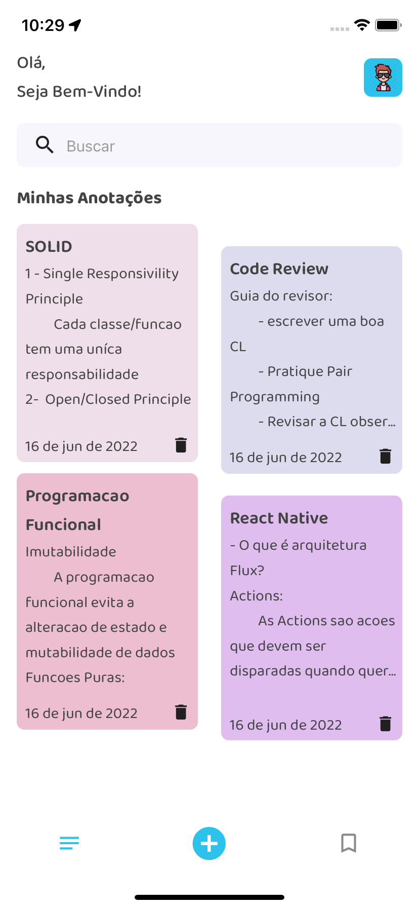

## 👋 Intro
O objetivo desse exercício é construir um aplicativo em React Native para salvar suas anotações.

## 📱 Telas
|  |  |
|:----------------------------------:|:--------------------------------------------:|

## 👾 Tecnologias usadas
- __Linguagem__
	- [Typescript](https://github.com/microsoft/TypeScript)
- __Controle de estado__
	- [Context API](https://redux.js.org/)
- __Roteamento e navegação__
	- [React Navigation](https://reactnavigation.org/)
- __UI__
	- [Styled Components](https://github.com/styled-components/styled-components)
- __Animações__
	- [React Native Animatable](https://github.com/oblador/react-native-animatable)
---

